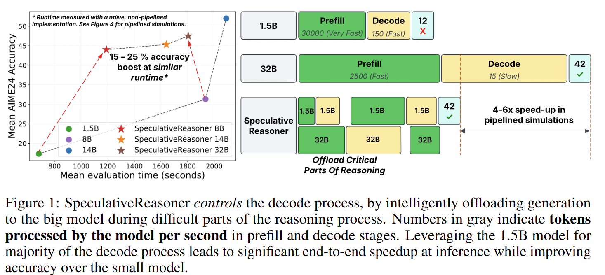

# Speculative Reasoning


In this library, we aim to support several 'methods' of composing Large-Small reasoning language models to improve trade-off in reasoning quality - tokens generated.


For running evaluation, put your HF_TOKEN and OPENAI_API_KEY in a .env file as:
```
OPENAI_API_KEY=XXXX
HF_TOKEN=XXXX
```

# Installation

`python -m pip install -r requirements.txt`

Additionally, please follow the setup commands below. We have to modify lm-evaluation-harness to:
- Route requests to our evaluation service.
- Add AIME24 and MATH tasks for evaluation.

```
# Check-out appropriate LM-Evaluation-Harness commit ID.
git clone git@github.com:EleutherAI/lm-evaluation-harness.git
cd lm-evaluation-harness
git checkout 4cec66e4e468d15789473d6d63c3a61a751fa524

cd ./../
# Add vllm_speculative and tasks.
cp lm_eval_files/vllm_speculative.py lm-evaluation-harness/lm_eval/models/
cp lm_eval_files/vllm_speculative_init.py lm-evaluation-harness/lm_eval/models/__init__.py
cp lm_eval_files/tasks_init.py lm-evaluation-harness/lm_eval/tasks/__init__.py
cp -r lm_eval_files/aime lm-evaluation-harness/lm_eval/tasks/
cp -r lm_eval_files/openai_math lm-evaluation-harness/lm_eval/tasks/
cp -r lm_eval_files/openai lm-evaluation-harness/lm_eval/tasks/gpqa

# Install package
cd lm-evaluation-harness
python -m pip install -e .[math,vllm]

cd ./../
```

Credit to [s1](https://github.com/simplescaling/s1/tree/main) for lm-evaluation-harness modifications.

# Adding new modes

- Add args to spec_service.py and test_spec.py

Example (Random switching baseline):

```
    parser.add_argument("--random_switch", action="store_true")
    parser.add_argument("--switch_ratio", type=int, default=1, help="Switching ratio, always 1:{switch_ratio}")
    parser.add_argument("--switch_chunk", type=int, default=16)
```

- Parse args from data

```
    switch_ratio = data.get("switch_ratio", service_args.switch_ratio)
    switch_chunk = data.get("switch_chunk", service_args.switch_chunk)
```

- Add condition on speculative_reason function. Note that requests, batched_generate_text_vllmm batched_eval_logprob_vllm should be passed appropriately, as they are used. (Just pattern-match with `logprob_subselect_flow`)

```
    elif data.get("random_switch", False):
        final_reply, usage_data = run_random_switch_flow(
            # Mode related args here
                switch_ratio=switch_ratio,
                switch_chunk=switch_chunk,
            # Pretty much mandatory args below
                question=question,
                test_logging=test_logging,
                temperature=temperature,
                max_tokens=max_tokens,
                terminating_string=terminating_string,
                big_model_port=service_args.big_model_port,
                big_model=service_args.big_model,
                small_model_port=service_args.small_model_port,
                small_model=service_args.small_model,
                batched_generate_text_vllm=batched_generate_text_vllm,
                batched_eval_logprob_vllm=batched_eval_logprob_vllm,
                requests=requests
        )
```

- Add new args to `cmd = []` in test_spec.py as well as payload
```
            f"--switch_ratio={args.switch_ratio}",
            f"--switch_chunk={args.switch_chunk}",
```

```
    # Handle optional args as before
    if args.random_switch:
        cmd.append("--random_switch")
```

```
# In payload in main()
        "random_switch": args.random_switch,
        "switch_ratio": args.switch_ratio,
        "switch_chunk": args.switch_chunk,
```

- Add the args to `lm_eval_files/vllm_speculative.py` in `__init__`
```
        self.random_switch = self.service_params.get("random_switch", False)
        self.switch_ratio = self.service_params.get("switch_ratio", 1)
        self.switch_chunk = self.service_params.get("switch_chunk", 16)
```

- Use the above initialized values in `lm_eval_files/vllm_speculative.py` initializer in `_ensure_correct_service_is_running`
```

            f"--switch_ratio={self.switch_ratio}",
            f"--switch_chunk={self.switch_chunk}",
```

```
        if self.random_switch:
            cmd.append("--random_switch")
```

- Update lm-eval
```

cp lm_eval_files/vllm_speculative.py lm-evaluation-harness/lm_eval/models/

cd lm-evaluation-harness
python -m pip install -e .[math,vllm]
```

- Add assertion in test_spec.py
    - `if sum([args.placeholder_mode, args.spec_rewrite, args.logprob_subselect, args.big_model_only, args.small_model_only, args.random_switch]) != 1:`

- Create `random_switch_flow.py` in modes, code the `run_random_switch_flow` function, add import to `spec_service.py` 
    - `from modes.random_switch_flow import run_random_switch_flow`


# Evaluate

`bash eval_script.sh`

# Test with custom questions

As an example, this will sequentially scale once, re-draft the CoT before the sequential scaling, re-write the full CoT everytime. Also it will encourage the small model to propose potential reasoning errors for continuity. 

`python test_spec.py --test_logging --big_model deepseek-ai/DeepSeek-R1-Distill-Qwen-7B --big_model_gpus 0 --small_model_gpus 1 --small_model deepseek-ai/DeepSeek-R1-Distill-Qwen-1.5B --logprob_subselect --sgen 512 --stok 16 --sdecay 2 --ltok 32`